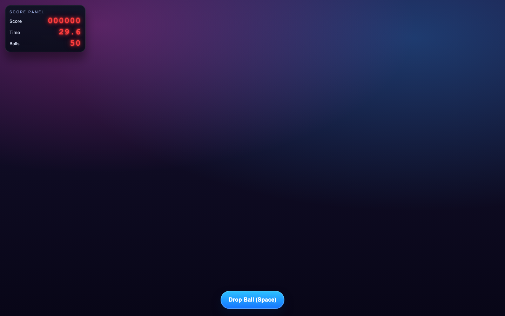
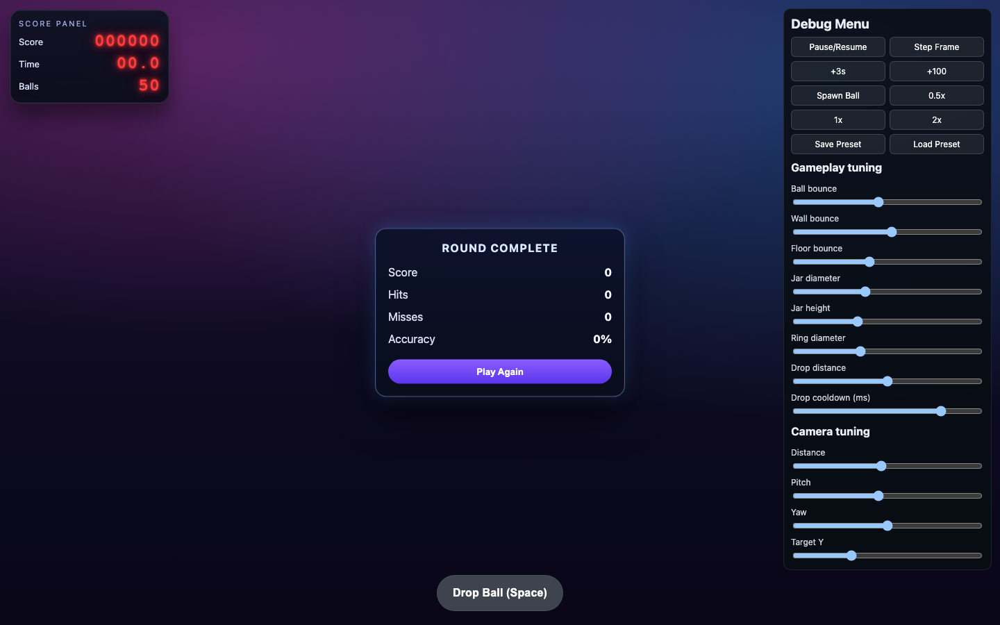
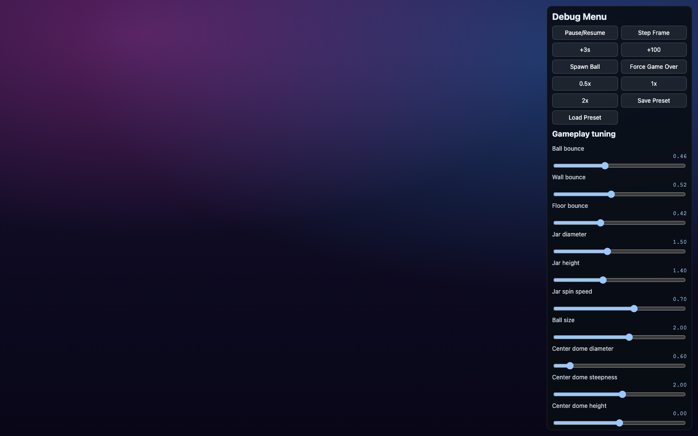
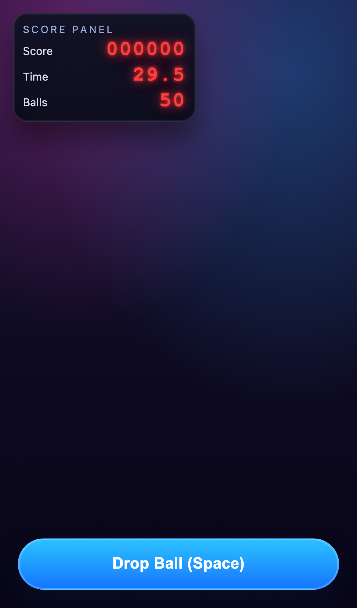
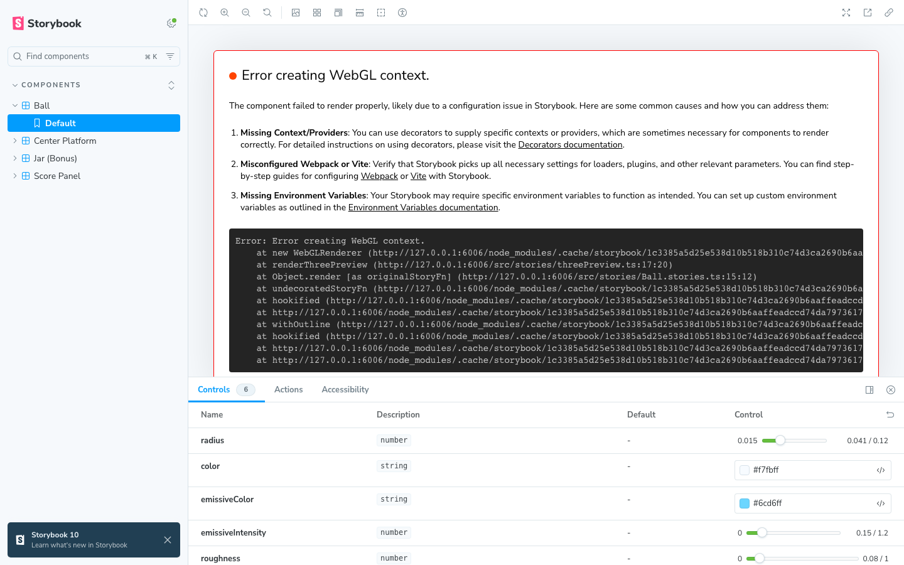
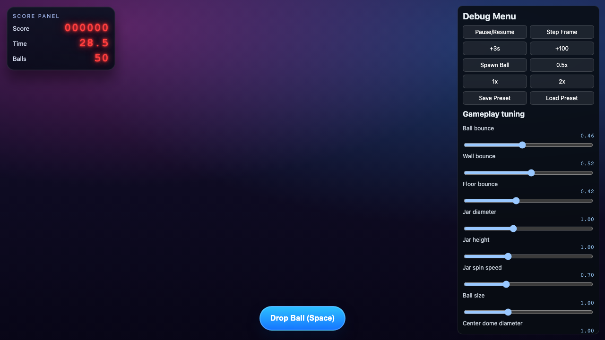

# Fast Drop

Browser-first 3D timing arcade game with physics-driven ball drops into rotating jars.

## Tech stack

- TypeScript
- Vite
- Three.js
- Rapier
- Vitest + coverage
- Playwright
- ESLint + Prettier
- Electron + electron-builder (desktop packaging)

## Getting started

```bash
npm install
npm run dev
```

Open http://localhost:5173.

For the component StorybookJS site, run `npm run storybook` and open http://localhost:6006.

Storybook stories currently included:

- Ball (size/material/color controls)
- Jar (bonus jar body/rim controls)
- Center Platform (radius/bridge/material controls)
- Outer Ring (diameter/material + LED chase tuning)
- Light Rig Lab (interactive light source/type/position/intensity experimentation)
- Jar Spinner (orbit radius/spin speed tuning)
- Score Panel (value/LED color/scale controls)
- Status Display (timer ring + balls remaining display with placement controls)
- Round Complete Dialog (summary UI states)

## Debug / camera / gameplay tuning toggles

- Use `?debug=1` in the URL to open the debug panel:
  - `http://localhost:5173/?debug=1`
- Use `?effects=0` (or `?fx=0`) to disable shader-driven LED/reflection effects on lower-end devices:
  - `http://localhost:5173/?effects=0`
- Use `?inputDebug=1` to print pointer/touch/click input decisions in the browser console (handy for mobile simulator debugging):
  - `http://localhost:5173/?inputDebug=1`
- Debug panel includes:
  - pause/resume + step
  - score/time mutators
  - speed controls
  - gameplay tuning (including jar spin speed, center dome diameter/steepness/height, ring diameter, ball size, drop height, screen display X/Y/Z placement + size, drop cooldown, ring LED enable/speed/head count/trail/reverse chance)
  - camera tuning (distance/pitch/yaw + lateral pan X, with wider zoom-out range)
  - lighting rig tuning (move lights, change light type, toggle each light on/off, add lights, and show light-source markers while debugging)
  - light legend showing each light id/name plus marker mapping (`●` source color, `◆` target)
  - stronger light helper emphasis: selected source markers render with a bright white halo + filled core; non-selected source markers stay dim and outline-only
  - live numeric values + selected light color hex value + copyable JSON snapshot for sharing tuned settings (including lights)
  - preset save/load
- Controls:
  - click/tap the page (outside UI controls) or press `Space` to drop
  - when a round ends, tap/click the playfield (outside UI controls) or press `Enter` / `Space` to play again
  - in `?debug=1`, scroll wheel zooms camera in/out (outside debug UI elements)

## Scripts

- `npm run dev` — start dev server
- `npm run storybook` — run StorybookJS locally on port 6006
- `npm run build-storybook` — build static StorybookJS output
- `npm run build` — typecheck + production build
- `npm run preview` — preview production build
- `npm run typecheck` — TypeScript checks
- `npm run lint` — ESLint
- `npm run lint:fix` — ESLint with auto-fixes
- `npm run format` — Prettier write
- `npm run format:check` — Prettier formatting validation
- `npm run test` — Vitest tests
- `npm run coverage` — Vitest with coverage metrics (`text`, `json-summary`, `html`, `lcov`)
- `npm run test:e2e` — Playwright tests
- `npm run check` — typecheck + lint + prettier check + coverage
- `npm run electron:start` — run desktop app using built web assets
- `npm run electron:smoke` — validate packaging inputs and perform a real Electron startup/load smoke check
- `npm run build:electron:win` — package Windows desktop artifacts
- `npm run release:electron:win` — run full quality gate, then package Windows artifacts

## Test timeout policy

The project keeps test timeouts intentionally short to surface hangs quickly.

Local defaults:

- Playwright test timeout: `15s`
- Playwright expect timeout: `3s`
- Playwright web server startup timeout: `45s`
- Vitest test/hook timeout: `10s`

GitHub Actions automatically uses a `2x` multiplier for these timeouts.

To reduce flakiness in CI, Playwright also runs with `1` worker and `1` retry when `CI=true`.

## Git hooks (Husky)

- Hooks are installed via `npm run prepare` (also runs during `npm install`).
- Pre-commit runs:
  - `npm run format` (Prettier `--write`)
  - re-stages previously staged files after formatting
  - `npm run format:check`
  - `npm run lint`
  - `npm run test`
  - `npm run coverage` (enforces global 90% minimum for statements/branches/functions/lines)
  - `npm run test:e2e`
- `.gitattributes` enforces LF line endings across platforms to prevent Windows CRLF drift from failing `npm run format:check` in CI.
- Coverage excludes runtime-heavy orchestration/render/audio UI files (`Game.ts`, `SceneRoot.ts`, `scene/lighting.ts`, `ui/debugMenu.ts`, `systems/AudioSystem.ts`, `systems/OrbitSystem.ts`, `ui/hud.ts`, `entities/StatusDisplay.ts`, `entities/ArcadeShell.ts`, `stories/**`) and pure type-only modules from threshold accounting so the 90% gate targets deterministic unit-testable logic.

## CI/CD

- Quality workflow: `.github/workflows/quality.yml`
- GitHub Pages deployment: `.github/workflows/deploy-pages.yml`
- Windows Electron build + release packaging: `.github/workflows/release-electron.yml` (runs on pull requests, pushes to `main`, published releases, or manual dispatch)

Windows Electron workflow behavior:

- runs on pull requests and pushes to `main` to continuously validate desktop packaging,
- uses Node.js 20 LTS for stable `electron-builder` compatibility on `windows-latest`,
- runs `npm run check`, `npm run build`, and `npm run electron:smoke`,
- builds `nsis` + `portable` artifacts via `electron-builder --publish never` (disables implicit CI publishing/token requirement),
- uploads packaged output as a 14-day workflow artifact on every run,
- updates a rolling prerelease tagged `latest` on pushes to `main` (overwrites Windows assets each run),
- still publishes assets to explicit GitHub Releases for `release.published` events,
- uploads diagnostics (`dist_electron/`, `test-results/`, `playwright-report/`) on failures.

## Current status

Implemented in this pass:

- deterministic round lifecycle (`playing`/`ended`) + restart flow,
- hit/miss/balls-dropped stats + derived accuracy,
- deterministic round-end conditions (timer expiry or immediate ball exhaustion),
- end-of-round summary overlay with Play Again (`Enter`/`Space` shortcuts),
- e2e regressions for summary/round-end behavior,
- configurable drop cooldown (default 160ms, debug-tunable),
- click-anywhere drop input (outside UI controls),
- visual style refresh inspired by the neon reference image,
- decorative outer ring around the jar orbit,
- in-world status display above the jars (left timer ring shifts from green to red with a needle, right side shows balls remaining),
- status display visual refresh: rounded monitor-style bezel, recessed screen, and larger default scale (1.3),
- round-end status display now uses stronger depth cues (layered screen glass/frame, pedestal/jar shadows, richer gradients, and raised result badge styling),
- LED chase effect on the outer ring with moving multi-color heads, soft gradient blending, and trailing glow,
- center dome now receives a subtle shader-based animated reflection driven by the outer-ring LED phase,
- material/lighting polish pass (metallic center, glass jars, red rubber balls),
- visual shell pass: transparent outer enclosure around the playfield, glass drop tube linked to ball diameter, and a front red LED "DROP" arcade button that pulses on each drop,
- audio polish pass with dynamic-range compression and event throttling to reduce clipping/stacking,
- improved HUD/summary readability polish and mobile-safe-area spacing,
- mobile viewport-fit polish for dynamic viewport units (`dvh`/`svh`) so layout scales better on phones,
- ball size updated to 0.157 reference diameter (relative to jar diameter scaling),
- added StorybookJS component stories for ball, bonus jar, center platform, outer ring, jar spinner, score panel, and round-complete dialog,
- debug menu now shows live control values and a copyable JSON snapshot of current tuning for easy sharing,
- debug menu lighting controls for moving lights, swapping light type, toggling light enabled/disabled, and adding extra lights.
- debug camera wheel zoom in `?debug=1` now supports a farther zoom-out range, plus visible light-source markers while tuning lighting.
- debug controls for center dome diameter and enabling/disabling outer ring LED chase.
- debug lighting legend now maps each light id/name to visible source/target helper markers and clearly tags the selected light.
- optional shader-effects kill switch via URL (`?effects=0` / `?fx=0`) to reduce GPU load.
- outer ring Storybook story now includes live LED chase controls (enable/speed/heads/trail/reverse chance).
- added Storybook "Light Rig Lab" story for interactive light-source experimentation.

## Representative screenshots

### Neon gameplay (desktop)



### Round summary overlay



### In-world game-over/status display depth refresh



### Neon gameplay (mobile)



### StorybookJS controls (component isolation)



### Debug light legend


### Effects disabled (`?effects=0`)


