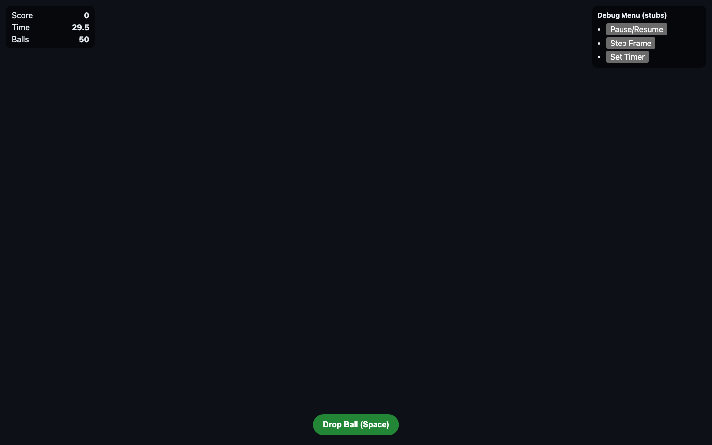
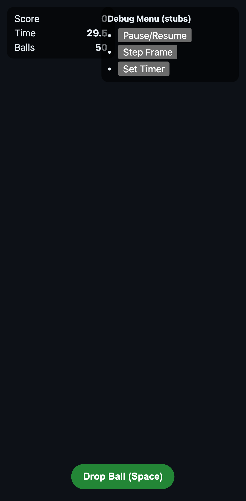

# Fast Drop

Bootstrap project for a browser-based 3D timing arcade game.

## Tech stack

- TypeScript
- Vite
- Three.js
- Rapier
- Vitest + coverage
- Playwright
- ESLint + Prettier

## Getting started

```bash
npm install
npm run dev
```

## Scripts

- `npm run dev` — start dev server
- `npm run build` — typecheck + production build
- `npm run preview` — preview production build
- `npm run typecheck` — TypeScript checks
- `npm run lint` — ESLint
- `npm run lint:fix` — ESLint with auto-fixes
- `npm run format` — Prettier write
- `npm run format:check` — Prettier formatting validation
- `npm run test` — Vitest tests
- `npm run coverage` — Vitest with coverage metrics (`text`, `json-summary`, `html`, `lcov`)
- `npm run test:e2e` — Playwright smoke tests
- `npm run check` — typecheck + lint + prettier check + coverage

## Git hooks (Husky)

- Hooks are installed via `npm run prepare` (also runs during `npm install`).
- Pre-commit runs:
  - `npm run lint`
  - `npm run test`
  - `npm run coverage` (enforces global 90% minimum for statements/branches/functions/lines)
  - `npm run test:e2e`

## Deployment

- GitHub Pages deployment is automated via `.github/workflows/deploy-pages.yml`.
- On each push to `main`, GitHub Actions builds and deploys `dist/`.

## Current status

Phase 0–4 bootstrap/handoff plan is complete (tooling, placeholder runtime, testing/CI gates, and stable gameplay hand-off interfaces). Next implementation order is documented in `docs/gameplay-implementation-order.md`.

## Representative screenshots

### Gameplay (desktop)


### Debug menu (desktop)



### Debug menu (mobile)


