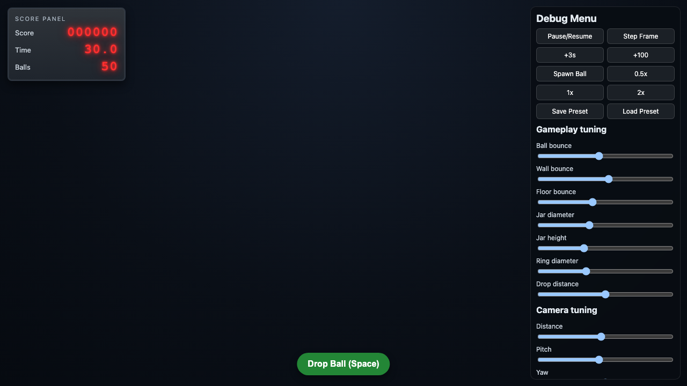
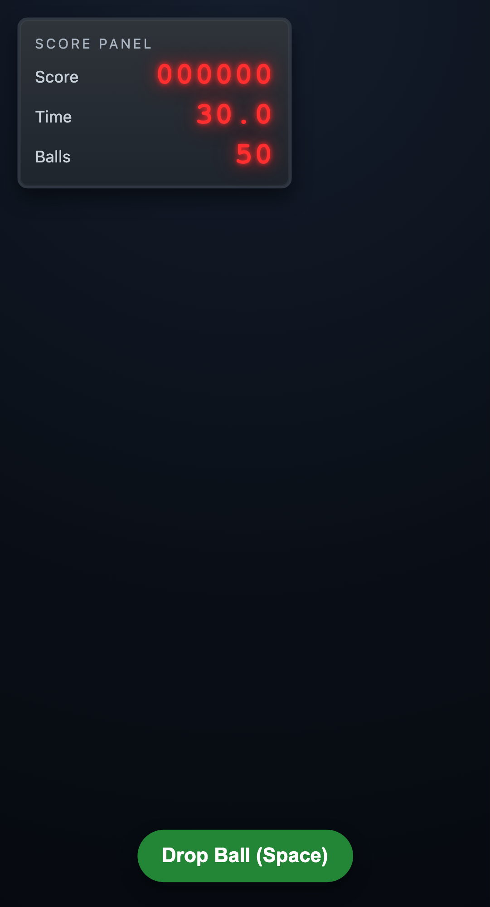

# Fast Drop

Browser-first 3D timing arcade game with physics-driven ball drops into rotating jars.

## Tech stack

- TypeScript
- Vite
- Three.js
- Rapier
- Vitest + coverage
- Playwright
- ESLint + Prettier
- Electron + electron-builder (desktop packaging)

## Getting started

```bash
npm install
npm run dev
```

## Scripts

- `npm run dev` — start dev server
- `npm run build` — typecheck + production build
- `npm run preview` — preview production build
- `npm run typecheck` — TypeScript checks
- `npm run lint` — ESLint
- `npm run lint:fix` — ESLint with auto-fixes
- `npm run format` — Prettier write
- `npm run format:check` — Prettier formatting validation
- `npm run test` — Vitest tests
- `npm run coverage` — Vitest with coverage metrics (`text`, `json-summary`, `html`, `lcov`)
- `npm run test:e2e` — Playwright tests
- `npm run check` — typecheck + lint + prettier check + coverage
- `npm run electron:start` — run desktop app using built web assets
- `npm run electron:smoke` — validate desktop packaging prerequisites
- `npm run build:electron:win` — package Windows desktop artifacts

## Git hooks (Husky)

- Hooks are installed via `npm run prepare` (also runs during `npm install`).
- Pre-commit runs:
  - `npm run lint`
  - `npm run test`
  - `npm run coverage` (enforces global 90% minimum for statements/branches/functions/lines)
  - `npm run test:e2e`
- Coverage excludes runtime-heavy orchestration/render/audio UI files (`Game.ts`, `SceneRoot.ts`, `ui/debugMenu.ts`, `systems/AudioSystem.ts`, `systems/OrbitSystem.ts`, `ui/hud.ts`) and pure type-only modules from threshold accounting so the 90% gate targets deterministic unit-testable logic.

## CI/CD

- Quality workflow: `.github/workflows/quality.yml`
- GitHub Pages deployment: `.github/workflows/deploy-pages.yml`
- Windows Electron release packaging: `.github/workflows/release-electron.yml`

## Current status

Gameplay plan phases 6–13 are complete:

- physics clean-entry scoring events,
- real scoring rules (jar values, center weighting, streak bonuses),
- pause/speed orbit controls,
- audio event mapping with mobile unlock,
- LED scoreboard HUD + live debug controls,
- runtime gameplay/camera tuning + preset save/load,
- arcade cabinet shell framing,
- Electron packaging path for Windows offline deployment.

## Representative screenshots

### Gameplay + debug controls (desktop)



### Gameplay (mobile)


